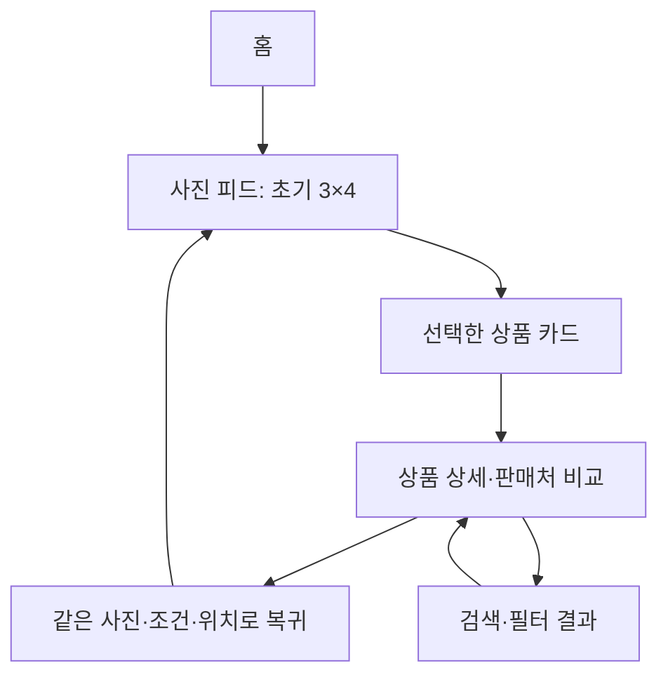

# 꼬까픽 — 실제 서비스 참고 분석과 탐색 동작 검토

2026-10-11 KST. **이번 결과는 참고 분석·설계 기준과 앱 내부 탐색 동작 보완입니다. 새 시각 디자인의 확정·출시 승인이 아닙니다.** 최근 거절한 06/08/09를 최종안으로 다시 추천하지 않습니다.

## 모바일에서 먼저 볼 내용

- [실제 참고 화면과 관찰](commercial-reference-audit.md): 카카오톡·Instagram·마미톡·ABLY·지그재그의 공개 자료. 조사자가 서로 다른 참고 화면 25장을 실제 열었습니다. 지그재그 공개 웹의 빈 화면도 실패로 기록했습니다.
- [꼬까픽 화면·동작 설계 기준](reference-led-design-brief.md): 홈, 사진 피드, 선택 상품 카드, 상세, 검색·필터, 다자녀, 찜·마이까지 이어지는 요구와 아직 구현되지 않은 부분을 구분합니다.
- [이번 실행 근거](commercial-reference-evidence.json): 참고 조회 시각, 검사 범위와 공급자 상품 QA의 한계.
- [이전 시안 이미지](preview.md), [최신 다운로드 데모](../../react-preview/offline.html). 다운로드 데모는 로컬 HTTP 실행용이며 현재 정상 상품을 보여 주는 공개 실행 앱이 아닙니다.

## 디자인 측면에서 바뀐 판단

흰 배경 자체를 문제로 단정하지 않습니다. 실제 참고 화면에서는 사진이 넓게 쓰이고, 짧은 탭과 목록으로 조작을 묶으며, 상품의 브랜드·가격이 사진 가까이에 있습니다. 기존 꼬까픽의 반복 제목, 여러 줄 도구, 같은 중요도로 보이는 구획을 줄이는 것이 먼저입니다.

| 참고에서 확인한 것                                | 꼬까픽에 적용할 설계 기준                                                     |
| ------------------------------------------------- | ----------------------------------------------------------------------------- |
| 카카오톡의 평평한 목록과 짧은 보조 정보           | 마이·아이 선택·판매처 비교는 짧은 행과 구분선 중심                            |
| Instagram 공식 과거 검색 화면의 3열 사진          | 요청한 무간격 3×4와 가는 사진 경계 유지, 피드 외곽의 큰 패널 제거 검토        |
| 마미톡의 아이 이름·시기 맥락, 쇼핑의 사진·가격 행 | 선택된 아이를 짧은 한 행으로 연결, 큰 프로필·파스텔 카드 반복 배제            |
| ABLY의 사진·브랜드·상품명·가격 위계               | 탐색 도구를 줄이고 첫 상품·가격을 빨리 노출, 근거 없는 할인·순위·구매 수 배제 |

원색은 선택·CTA·품목 구분의 의미가 있는 곳에 사용합니다. 앱스토어 홍보 이미지 바깥의 원색 배경은 실제 앱 배경과 구분했습니다. 둥근 한국어 글꼴과 사진 경계는 사용자 요구로 유지하며, 모든 구획을 같은 카드로 감싸지 않습니다.

## 연결할 탐색 흐름

이 도식은 다음 시각 검토의 목표입니다. 현재 기술 화면의 사진 선택 dialog가 이미 별도의 간단한 상품 카드→상세 계층을 완성했다고 판단하지 않습니다. 아이별 맥락은 근거 있는 의류 사이즈 참고와 명시 사용 연령에만 연결하고, 없는 소재·실판매 옵션을 만들어 채우지 않습니다.

## 이번 동작 보완

검색 입력을 한 글자씩 브라우저 이력에 쌓던 문제와 상품 창을 닫으면 동일 목록 이력이 남던 문제를 실제 Chromium에서 재현했습니다. 검색 입력은 현재 검색 상태를 갱신하고, 앱에서 연 상품 창은 해당 이력만 안전하게 닫도록 수정했습니다. 직접 상세 링크·새로고침·외부 hash 변경의 안전한 닫기는 별도로 검사합니다.

사진 모드에서 상세를 닫거나 뒤로/앞으로 이동할 때 기존 조건·불러온 항목·선택 사진·초점·위치를 유지하는 검증을 포함합니다. 하단 탭을 오갔다 돌아오는 목록 보존도 이번 검토 대상입니다. 정확한 최종 결과는 위 실행 근거와 PR 본문에 기록합니다.

독립 검사에서 추가로 발견한 **탭 이동 직후 빠른 입력이 이전 탭으로 돌아가는 문제**, **데이터 로딩 중 탭을 왕복하면 이후 상품이 0개로 남는 문제**도 원래 재현 조건으로 수정·재검증했습니다. 목록 보존은 최근 8개 맥락의 개수·위치를 메모리에만 저장합니다. 상품 사진·아이 측정치를 새로 저장하거나 업로드하지 않습니다.

## 이번 검증 결과

로컬에서 typecheck·format·review/offline 빌드, 단위 테스트 **108개**, Chromium 브라우저 회귀 **34개**가 통과했습니다. 자동 반응형·접근성 검사는 320·375·390·430·1440px에서 수행했습니다. 루트와 독립 검토자가 새 핵심 모바일 **20장** 및 PC **5장**을 각각 직접 열었습니다. 독립 검토자는 별도 동작·만료 상태 8장도 열었고, 루트는 사진 창·실제 만료·독립 HTML 원본 미연결 상태를 추가 확인했습니다. [검토한 화면](commercial-reference-screenshots.md)과 [독립 검토](commercial-reference-independent-review.md)를 연결합니다. CI의 정확한 head와 결과는 [PR #207](https://github.com/chachazip-prog/kkokkapick/pull/207)에 기록합니다.

**통과 범위는 분석 사실성과 검사한 탐색 동작입니다. 출시 visual QA는 HOLD입니다.** 실제로 열린 화면에서 홈의 첫 상품·가격이 모바일 첫 화면 밖에 있고, 검색 도구가 여러 행을 차지하며, 찜의 아주 긴 상품명이 가격을 지나치게 밀어내는 기존 문제를 확인했습니다. 이 세 문제를 다음 연결 시안의 필수 수정으로 넘겼습니다. 화면의 controlled 사진은 검증 전용으로 명시하며 실제 판매 상품으로 소개하지 않습니다.

새 독립 HTML도 정상 로컬 HTTP에서 직접 실행해 390px의 기존 시안 한 화면과 기술 화면 4개를 검사했습니다. 글꼴·캠페인 이미지 decoding, 수평 넘침 0·브라우저 오류 0·공급자 사진 요청 0을 확인했습니다. 이 다운로드는 상품 원본을 포함하지 않으므로 **원본 미연결 상태**이며, 작동하는 공개 상품 앱으로 소개하지 않습니다.

## 확인한 범위와 남은 한계

참고 앱의 네이티브 로그인·실제 iPhone 내부 동작을 직접 시험하지 않았습니다. ABLY 공개 모바일 웹에서는 홈→카테고리→브라우저 뒤로→홈을 실제 확인했습니다. Instagram 그리드의 공식 그림은 **2021년 자료**로 표시하고, 현재 앱의 실사용 증거로 소개하지 않습니다.

꼬까픽의 실제 상품 원본은 만료되어 있습니다. 현재 데모에 연결된 기존 게시 데이터의 수집 시각은 2026-10-09 **09:35:14.464 KST**, 내부 사진 표시 기한은 **11:05:14.464 KST — 만료**입니다. 유일한 후속 full 수집은 같은 날 **16:33:14.805 KST**, 사진 표시 기한 **18:03:14.805 KST — 만료**이며 게시 gate를 통과하지 못했습니다. 두 원본을 구분합니다. 이번 작업에서 새 수집·전체 공급자 사진 검사·새 게시 상품의 브라우저 QA는 실행하지 않았습니다. 동작 검사의 controlled 사진은 테스트 전용이고 다운로드 데모에는 포함하지 않습니다.

소재·실판매 사이즈·명시 사용 연령 원본, 지속 가능한 이미지 공급·재표시 권리, 운영주체 정보, 실제 iPhone Product Owner 검토는 미해결입니다. main 미병합·운영 미배포이며 선택 ID도 없습니다. 다음 시각 검토본은 위 참고 근거를 바탕으로 먼저 제시하고, Product Owner가 선택한 방향을 구현합니다.
