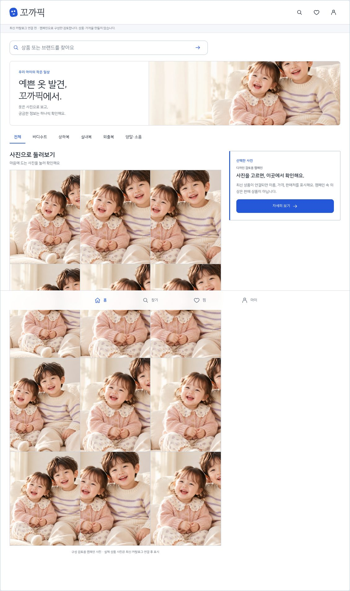
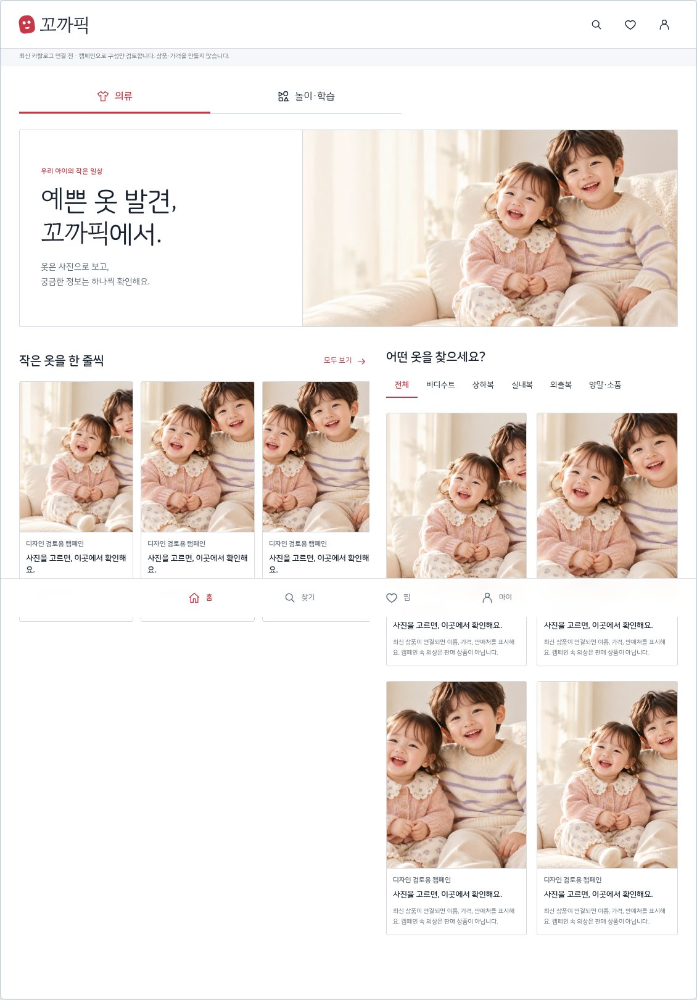
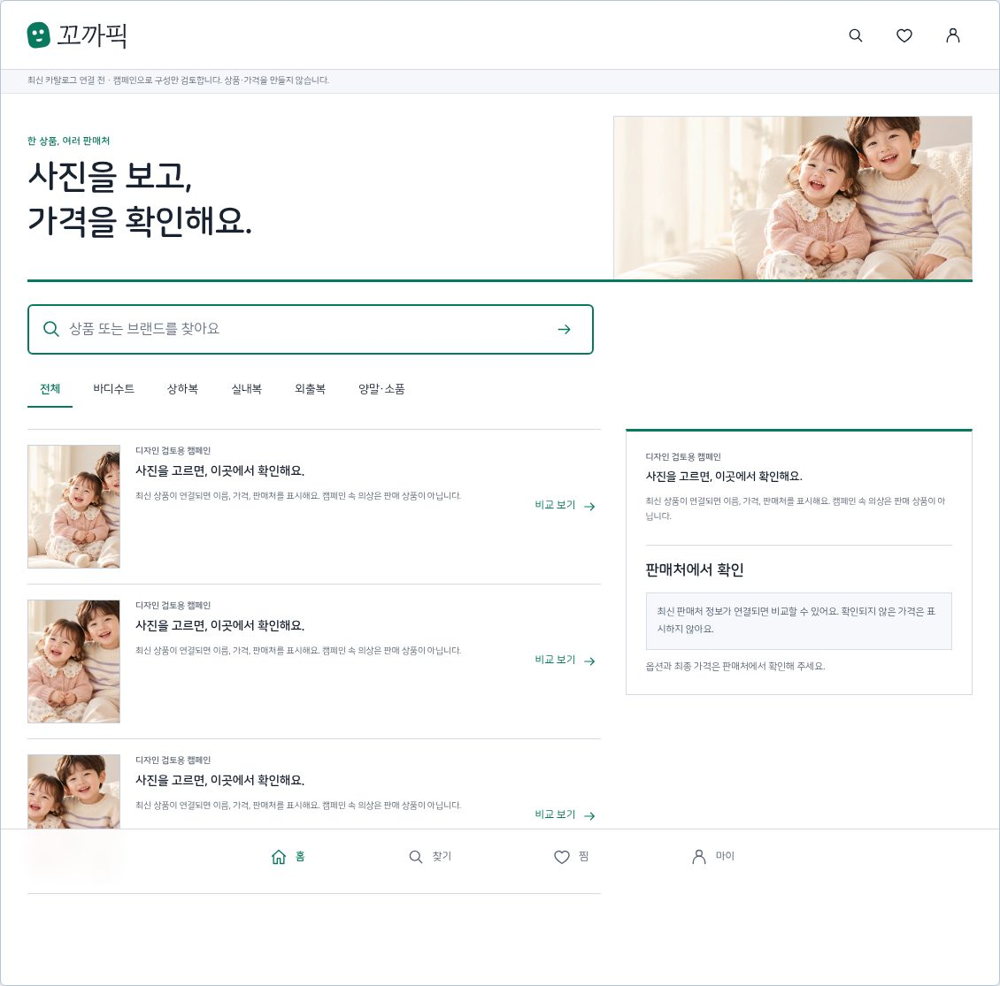
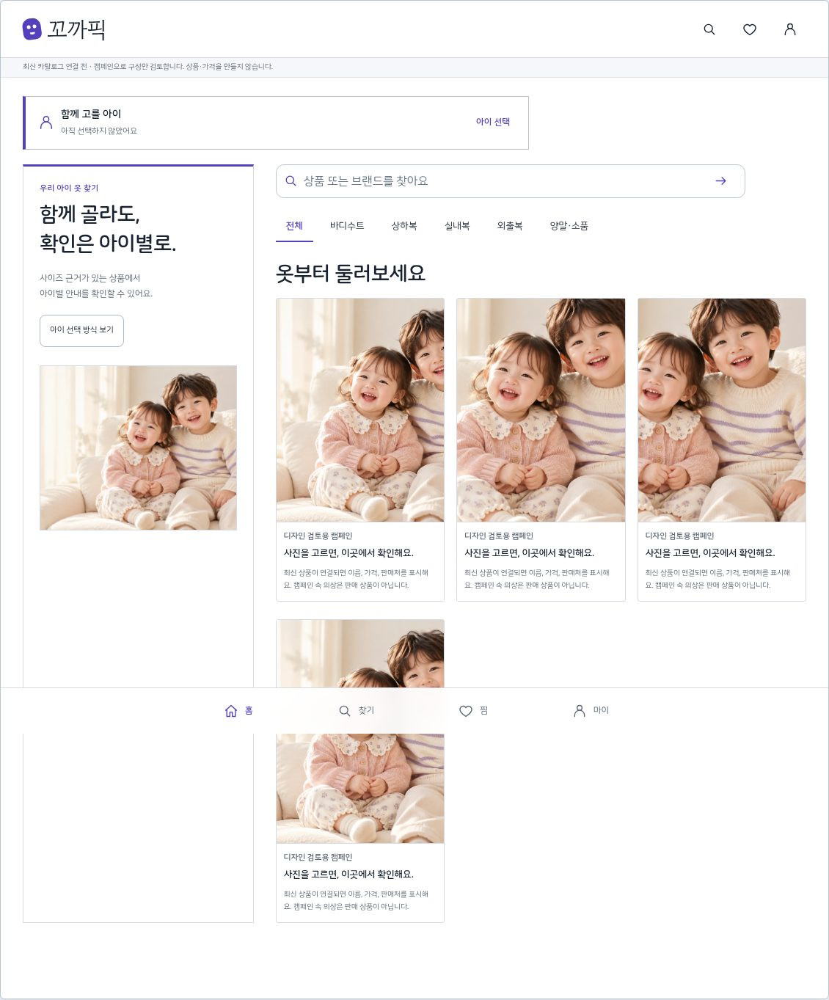
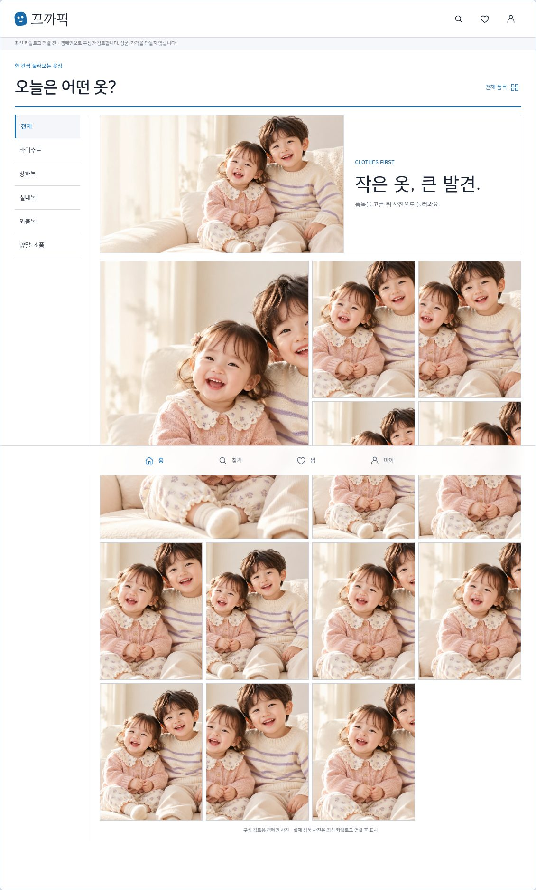
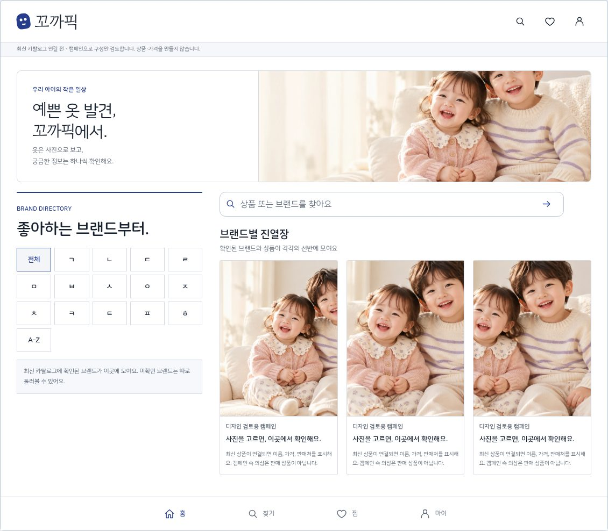
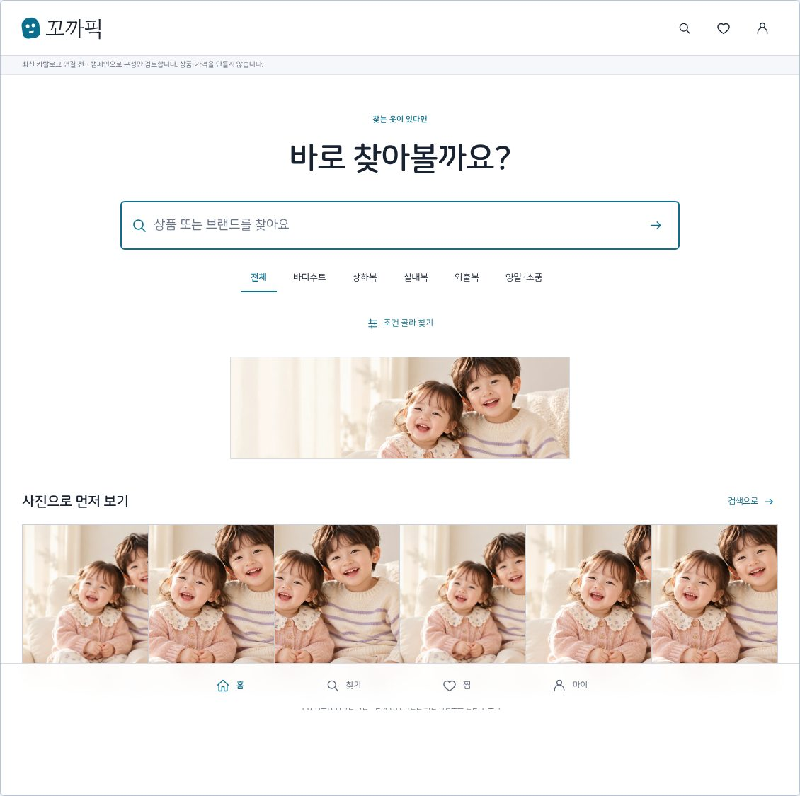
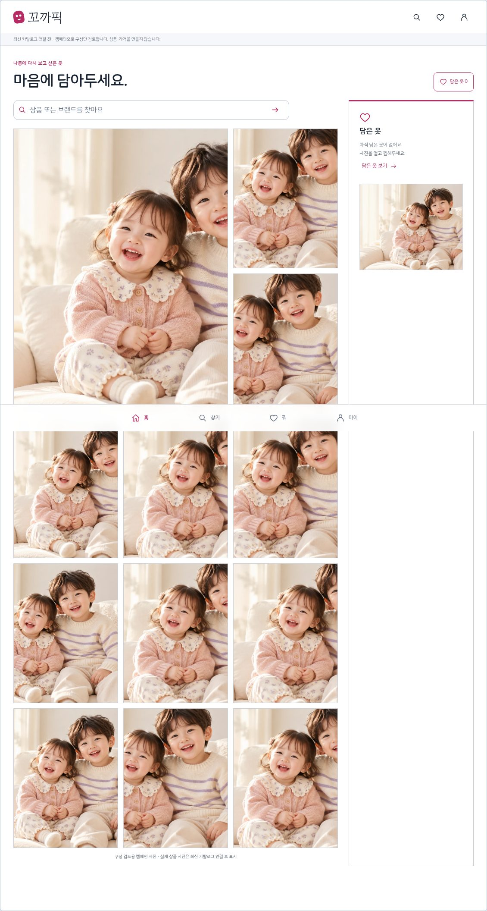
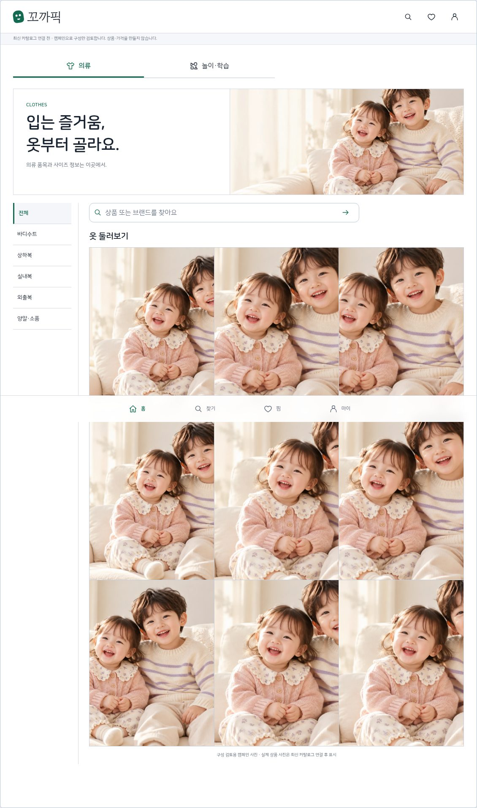
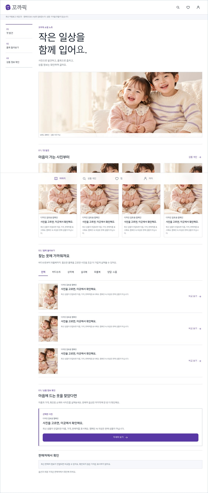

# 꼬까픽 UX/UI 10안 비교

**검토용 변경안이며 최종 방향은 아직 확정하지 않았습니다.** 권장안은 **01 · 사진으로 쏙쏙**입니다. 요청한 무간격 3열 사진 탐색과 사진 선택 후 상품 카드가 핵심입니다. 각 안의 홈·검색·상세·팝업은 다운로드 데모에서도 비교할 수 있습니다.

실제 상품 원본은 현재 표시 기한이 지났습니다. 아래 이미지는 **기존 승인 캠페인으로 구성만 비교**하며 캠페인 속 의상을 판매 상품으로 표시하지 않습니다. 가격·소재·판매 사이즈를 만들지 않았습니다. 출시 사진 QA나 실제 iPhone PO 승인으로 간주하지 않습니다.

- [변경안별 근거·동작·위험·반응형 설명](design-proposals.md)
- [기능/시각 검증 범위와 남은 출시 조건](verification.md)
- [PC 다운로드 데모](../../react-preview/offline.html): 파일을 다운로드해 브라우저에서 열거나 로컬 HTTP 서버로 제공. 글꼴·캠페인·React 코드를 한 파일에 포함했습니다. 원본 상품 데이터가 연결되지 않으면 검토 보류 상태입니다.
- 기존 GitHack 실행 주소는 현재 접근 검증에서 HTTP403을 반환하여 정상 공개 데모로 안내하지 않습니다.

| 번호 | 방향 | 홈 | 검색 | 상세 |
| --- | --- | --- | --- | --- |
| **01** | **사진으로 쏙쏙** | [화면](proposal-images/01-home.jpg) | [화면](proposal-images/01-search.jpg) | [화면](proposal-images/01-detail.jpg) |
| **02** | **오늘의 작은 옷장** | [화면](proposal-images/02-home.jpg) | [화면](proposal-images/02-search.jpg) | [화면](proposal-images/02-detail.jpg) |
| **03** | **한눈에 가격 비교** | [화면](proposal-images/03-home.jpg) | [화면](proposal-images/03-search.jpg) | [화면](proposal-images/03-detail.jpg) |
| **04** | **우리 아이 기준** | [화면](proposal-images/04-home.jpg) | [화면](proposal-images/04-search.jpg) | [화면](proposal-images/04-detail.jpg) |
| **05** | **품목별 옷장** | [화면](proposal-images/05-home.jpg) | [화면](proposal-images/05-search.jpg) | [화면](proposal-images/05-detail.jpg) |
| **06** | **브랜드 산책** | [화면](proposal-images/06-home.jpg) | [화면](proposal-images/06-search.jpg) | [화면](proposal-images/06-detail.jpg) |
| **07** | **바로 찾는 꼬까** | [화면](proposal-images/07-home.jpg) | [화면](proposal-images/07-search.jpg) | [화면](proposal-images/07-detail.jpg) |
| **08** | **마음에 담은 보드** | [화면](proposal-images/08-home.jpg) | [화면](proposal-images/08-search.jpg) | [화면](proposal-images/08-detail.jpg) |
| **09** | **입고, 놀고** | [화면](proposal-images/09-home.jpg) | [화면](proposal-images/09-search.jpg) | [화면](proposal-images/09-detail.jpg) |
| **10** | **작은 옷 이야기** | [화면](proposal-images/10-home.jpg) | [화면](proposal-images/10-search.jpg) | [화면](proposal-images/10-detail.jpg) |

아래 항목을 펼치면 홈 구성을 비교할 수 있습니다. 이미지별 검색·상세 링크는 위 표에 있습니다.

01 · 사진으로 쏙쏙

02 · 오늘의 작은 옷장

03 · 한눈에 가격 비교

04 · 우리 아이 기준

05 · 품목별 옷장

06 · 브랜드 산책

07 · 바로 찾는 꼬까

08 · 마음에 담은 보드

09 · 입고, 놀고

10 · 작은 옷 이야기

