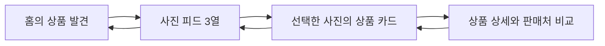

# 꼬까픽 — 상업 서비스 참고 분석에 따른 디자인·동작 핸드오프

작성: 2026-10-10 UTC / 2026-10-11 KST. 코드 기준 head는 `e72847e079689212ffc6404fded1aa9cf8654e79`이며, 이번 문서는 연구와 설계 기준이다. 생산 UI·CSS·디자인 토큰을 바꾸거나 최종 디자인 선택을 기록하지 않는다. 06/08/09는 관심을 받은 뒤 추가 개선 요청을 받은 검토 후보이며, Product Owner는 최근 결과물의 디자인 품질을 다시 거절했다. **최종 선택 ID: 없음.**

목적은 다른 앱의 외형을 통째로 옮기는 것이 아니라, 부모가 짧은 시간에 사진을 훑고 가격·판매처·사이즈를 확인하는 작업을 자연스럽게 연결하는 것이다. 다음 시각 검토는 이 문서의 흐름과 현실적인 정보 위계를 근거로 해야 한다. 연구를 곧 승인된 단일 최종안으로 취급하거나 기존 거절안을 조용히 혼합하지 않는다.

## 1. 확인한 근거와 확인하지 못한 범위

연구 담당자가 정상 공개 Apple App Store 경로로 내려받은 공식 마케팅 화면 가운데 아래 다섯 이미지, Instagram의 과거 공식 검색 소개 이미지 한 장, ABLY의 실제 공개 웹 카테고리·홈 복귀 캡처 두 장을 문서 작성자가 실제로 열어 확인했다. 공개 스토어 자료는 앱 화면이 포함된 마케팅 합성 이미지다. 바깥의 큰 홍보 문구, 노랑·보라 배경, 휴대폰 목업 테두리는 **앱 UI의 배경·글자 크기로 해석하지 않았다.** 이미지가 보여주는 구조와 제공되지 않은 내부 동작을 구분한다.

| 공개 공식 출처                                                                                                                    | 실제 열람 화면                                            | 관찰한 구조                                                                                                  | 꼬까픽에 적용할 판단 / 추정                                                                                                                                                                     |
| --------------------------------------------------------------------------------------------------------------------------------- | --------------------------------------------------------- | ------------------------------------------------------------------------------------------------------------ | ----------------------------------------------------------------------------------------------------------------------------------------------------------------------------------------------- |
| [카카오톡 한국 App Store](https://apps.apple.com/kr/app/id362057947)                                                              | 오픈채팅 목록 (`kakao-04.png`)                            | 작은 아바타·제목·보조 설명·시간의 반복 행, 간결한 탭, 하단 아이콘 메뉴. 행의 주요 정보가 한눈에 연결됨.      | My·아이 선택·판매처 목록은 독립된 큰 카드 대신 짧은 행과 구분선으로 정리. 실제 카카오의 눌림·뒤로 가기·목록 복원은 이 화면만으로 확인하지 못함.                                                 |
| [Instagram 한국 App Store](https://apps.apple.com/kr/app/id389801252)                                                             | 홈 피드 (`instagram-03.jpg`)                              | 화면 폭을 쓰는 사진, 짧은 작성자 행, 사진 아래 가벼운 동작 묶음, 하단 내비게이션. 사진 주변의 문법이 단순함. | 사진 탐색을 툴바·설명으로 덮지 않음. 이 App Store 표본에는 Explore 그리드가 없음. Explore의 탭→상세→복귀·스크롤 복원은 실앱 미검증.                                                             |
| [Instagram 공식 검색 소개](https://about.instagram.com/blog/announcements/break-down-how-instagram-search-works), 2021-08-25 게시 | 검색 결과 사진 그리드 (`instagram-search-photo-grid.jpg`) | 검색·짧은 탭 아래의 3열 사진, 좁은 공유 경계, 개별 모서리 장식 없음. 일부 큰 타일은 두 칸 이상을 차지함.     | 3열·사진 중심·단순한 경계의 공식 참고 근거. 꼬까픽은 사용자 요구에 따라 **동일 크기 3×4**를 유지하며 이 이미지의 큰 타일 혼합을 복사하지 않음. 2021 소개 화면을 2026 현재 앱으로 표시하지 않음. |
| [마미톡 한국 App Store](https://apps.apple.com/kr/app/id1494440076)                                                               | 성장 기록 (`mamitalk-05-large.jpg`)                       | 아이 이름·경과 월령이 화면의 맥락을 만들고, 네 개의 짧은 바로가기가 이어짐. 기록 기능에는 카드 사용.         | 꼬까픽에서는 선택된 아이를 짧은 한 행으로 보이게 하되 성장 기록·큰 프로필 카드·아이 사진 수집을 추가하지 않음. 아이 맥락이 상품보다 커지지 않게 번역.                                           |
| 같은 마미톡 출처                                                                                                                  | 쇼핑 (`mamitalk-07-large.jpg`)                            | 텍스트 탭과 밑줄, 상품 사진·상품명·가격을 붙인 가로 행. 캠페인과 실제 상품 정보의 영역이 구분됨.             | 가격 비교 판매처 행과 찜 목록에 가까운 사진·정보 묶음 사용. 공동구매·장바구니·달성률·주문 기능은 꼬까픽 범위에 없음.                                                                            |
| [에이블리 한국 App Store](https://apps.apple.com/kr/app/id1084960428)                                                             | 랭킹 상품 목록 (`ably-08-large.jpg`)                      | 검색창→짧은 텍스트 탭→작은 이미지 범주→사진 우선 2열 상품. 브랜드·상품명·가격의 크기와 농도가 다름.          | 검색 이후 상품을 빨리 노출하고, 상품 카드의 사진과 가격을 붙임. 인기 순위·할인율·쿠폰·구매 수를 원본 근거 없이 복제하지 않음.                                                                   |

App Store 화면 수집·열람 시각은 2026-10-10 22:28:48–22:29:46 UTC, 2026-10-11 07:28:48–07:29:46 KST다. 공식 과거 검색 이미지 추가 수집은 22:31:13 UTC이며 작성자도 직접 열람했다. [Instagram의 2023-05-31 공식 설명](https://about.instagram.com/blog/announcements/instagram-ranking-explained)은 Explore를 추천 사진·영상 그리드로 설명하지만 내부 제스처를 실제 검사한 근거는 아니다. 자세한 출처·파일·접근 상태는 [상업 서비스 공개 참고 분석](commercial-reference-audit.md)에 기록한다. 로컬 연구 이미지는 `/tmp/kkokkapick-commercial-references/` 아래 있으며 꼬까픽 출시 자산이 아니다. 다른 브랜드 화면·사진·로고를 제품에 넣는 작업을 하지 않았다.

[ABLY의 공개 모바일 웹](https://mobile.a-bly.com/)에서는 연구 담당자가 390×844 Chromium으로 홈→카테고리 `/overview`→브라우저 뒤로→홈 `/`를 실제 실행했다. 검사 시작은 2026-10-10 22:32:44.959 UTC다. 작성자는 `ably-category-public-web-390.png`, `ably-back-public-web-390.png` 두 결과를 직접 열었다. 카테고리는 좌측 큰 범주와 우측 세부 텍스트 목록, 복귀한 홈에는 3열 상품이 보였다. 따라서 **ABLY가 항상 2열이라는 결론은 없다.** 이 짧은 공개 웹 이동 성공은 깊은 스크롤 위치 복원·상품 선택·네이티브 앱 검증의 근거로 확대하지 않는다.

실앱의 로그인 후 상태, 장시간 스크롤, Android/iOS 제스처 뒤로 가기, 검색 조건 유지, 오프라인 복구, 접근성 읽기 순서는 아직 검증하지 못했다. 아래 내부 동작은 꼬까픽의 사용자 요구·기존 계약·관찰된 사용 목적을 바탕으로 한 **설계 요구**이지 참고 앱을 직접 조작해 얻은 사실이 아니다.

## 2. 현재 거절안에서 확인한 문제

실제 열람: `round-two-images/{06,08,09}-home-mobile.jpg`의 만료 상태 세 장, 이전 독립 검토의 controlled `06-home-390`, `08-home-390`, `08-detail-390`, `09-search-390` 네 장. controlled 사진은 `CONTROLLED UI TEST`라는 글자가 있는 기능 검증 표본이며 공급자 상품·패션 사진이 아니다. 이전 표본은 최신 수정 이후 모든 배치와 동일하다고 가정하지 않았다. 구조 확인은 `RefinedScenes.tsx`, `refinements.css`, `TechnicalApp.tsx`, `UX-CONTRACT.md`와 함께 진행했다.

| 확인한 문제                                                         | 근거와 영향                                                                                                                                                                | 다음 시각 검토의 요구                                                                                                                                              |
| ------------------------------------------------------------------- | -------------------------------------------------------------------------------------------------------------------------------------------------------------------------- | ------------------------------------------------------------------------------------------------------------------------------------------------------------------ |
| 06에서 브랜드 디렉터리와 섹션 안내가 상품 발견보다 먼저 길게 이어짐 | `BrandHome`은 Campaign→BrandDirectory→상품 목록 순서. controlled 390 표본의 첫 상품 사진은 화면 아래쪽에 걸치고 가격은 보이지 않음.                                        | 브랜드에 대한 명확한 의도가 없는 첫 방문에도 실제 상품 사진과 가격을 빠르게 볼 수 있어야 함. 브랜드 전체 디렉터리는 검색 안의 보조 경로로 다룸.                    |
| 08에서 탐색 화면 위에 여러 조작 행이 겹침                           | 둘러보기/담은 상품, 사진/정보, 검색, 조건, 범주의 기능을 각각 배치. 이전 controlled 표본에는 선언형 제목도 있었음. 최신 일부 제목은 이미 제거되었으므로 재등장시키지 않음. | 필수 조작을 한 번씩 배치. 사진 피드 입구에서 저장 보기·검색·필터를 모두 같은 비중으로 늘어놓지 않음. 초기 12장 요구와 조작 가독성을 같이 검토.                     |
| 09 검색의 도메인 탭·새 제목·조건·검색·범주가 상품과 경쟁            | 기능적으로 필요한 도메인 구분이 새 큰 안내 제목과 반복되어 밀도를 낮춤.                                                                                                    | 도메인 탭과 검색창에 이미 드러난 맥락을 다시 제목으로 설명하지 않음. 선택된 필터는 짧은 요약으로 표시.                                                             |
| 화면의 거의 모든 구획에 같은 선·배경·여백 리듬                      | `.kr-categories`, `.kr-domain-switch`, `.kr-empty`, 카드 경계가 연속됨. 시선이 상품보다 분절된 UI 틀을 따라감.                                                             | 경계는 사진·입력·다른 판매처·고정 동작을 구분하는 데 사용. 모든 제목/문장/섹션에 동일한 박스를 만들지 않음.                                                        |
| 전역 헤더 동작과 하단 메뉴의 역할이 중복                            | 전역 검색·찜·계정 아이콘이 하단 검색·찜·마이와 겹침.                                                                                                                       | 모바일 헤더에는 브랜드와 필요한 아이 맥락만 우선. 검색 화면의 입력·상세 화면의 돌아가기처럼 현재 작업의 동작을 맡김. PC에서만 접근성·공간에 맞는 전역 메뉴를 검토. |
| 만료 화면에서 같은 실패 설명이 반복되고 빈 화면이 길게 남음         | 만료 상단 안내와 목록 빈 상태, 06 브랜드 갱신 설명이 겹쳐 있음.                                                                                                            | 한 개의 명확한 갱신 상태와 실제 가능한 다음 행동을 제시. 보존된 찜/아이 정보를 살리되 만료 상품 사진·가격으로 빈 공간을 채우지 않음.                               |

반복 틀과 과도한 안내는 실제 코드·화면에서 확인할 수 있다. **유효한 실제 상품 사진이 현재 없으므로 사진과 배경의 최종 색 조화, 상품 다양성이 만드는 밀도, 실제 패션 커머스로 보이는 정도는 판단할 수 없다.** 이 한계를 UI 구조상의 지적까지 회피하는 이유로 쓰지 않는다. 색만 더 강하게 바꾸거나 사진 없음을 임시 사진으로 덮는 것이 해결책은 아니다.

## 3. 다음 디자인 검토의 공통 기준

### 정보와 동작의 우선순위

1. 사진으로 어떤 상품인지 파악한다.
2. 브랜드·읽기 쉬운 상품명·가격·실제 판매처 수로 비교할 이유를 안다.
3. 선택된 아이를 기준으로 **근거가 있는 경우만** 사이즈 또는 사용 연령을 확인한다.
4. 저장하거나 판매처로 이동한다.

네 개의 하단 메뉴 홈·검색·찜·마이는 유지한다. 사진 피드는 홈/검색에서 접근할 수 있는 상품 표시 방식이며 별도의 다섯 번째 메뉴를 추가하지 않는다. 의류가 기본이고 장난감·교구는 명시적으로 전환 가능한 별도 영역이다. 검색어·범주·판매 사이즈를 다른 도메인으로 무조건 옮기지 않는다. 선택된 아이와 찜 데이터는 기기 안에 남긴다.

### 글꼴과 텍스트

- 사용자가 요청한 둥근 한국어 글꼴을 존중한다. 기존 자체 호스팅 NanumSquareRound를 본문·조작의 기준으로 사용하되, 실제 긴 상품명·숫자 가격·두 줄 문장을 함께 확인한다. 외부 폰트 서비스나 새 폰트 비용을 추가할 이유가 없다.
- 본문 14–15px/400, 보조 12–13px/400–500, 상품명 13–14px/400–500, 섹션 16–18px/600, 가격 16–18px/600–700을 **검토 시작 범위**로 삼는다. 입력은 iOS 확대를 피하도록 최소 16px. 800–900 굵기는 사용하지 않는다.
- 로고는 기존 이름을 쓰되 본문 텍스트처럼 긴 여백과 밑줄을 붙이지 않는다. 브랜드 글자와 캠페인 글자의 형태를 별도로 비교하고, 공개 앱의 로고를 가져오지 않는다. 최종 wordmark·키배너 글꼴은 PO가 볼 시각 산출물에서 결정한다.
- 목록 상품명은 두 줄까지 읽히게 하고, 가격은 다음 고정 행에 둔다. 상세는 전체 정리 이름을 읽을 수 있게 한다. 원본 상품명은 접힌 정보에 보존. 코드·중복 브랜드·괄호 정리는 원본과 별개인 표시 필드만 다룬다.
- “최저”, “할인”, “인기”, “아이에게 맞아요”에는 원본 또는 계산의 근거가 있어야 한다. 한 판매처만 있으면 일반 가격이며 비교 수를 과장하지 않는다.

### 색·배경·선의 역할

- 기본 배경은 화면 역할로 결정한다. 사진을 놓는 상품 영역, 입력 표면, 메뉴 구획, 만료 안내를 구분하되 모든 섹션을 같은 색 카드로 만들지 않는다. 흰색 비율을 줄이기 위해 파스텔 면적만 늘리지 않는다.
- 브랜드 보라는 정체성·활성 상태, 소수의 명확한 원색은 선택·찜·중요 동작·상태 안내에 사용한다. 상태마다 다른 대표색을 계속 추가하지 않는다. 최종 팔레트는 실제 유효 상품 사진과 함께 검토하며 이 문서에서 고정하지 않는다.
- 상품 카드/사진에는 사용자 요구에 따라 1px 정도의 안정적인 경계를 준다. 사진 피드는 간격 0이고 인접 사진 사이에는 공유 1px 경계만 둔다. 두 이웃 타일의 두 선이 겹쳐 진해지지 않게 한다. 타일별 둥근 모서리·그림자는 쓰지 않는다.
- 일반 상품 카드의 사진은 8–10px 모서리를 검토하되 정보 전체를 다시 둥근 카드 안에 넣지 않는다. 입력 8–10px, sheet/dialog 12–16px는 역할에 맞게 검토. 판매처 목록은 구분선 중심, 그림자는 떠 있는 overlay에 한정.
- 설명 문구는 낮은 강조도로 한 번만 제공한다. 진한 원색 배너가 사진보다 먼저 보이는 구성을 피한다. “키즈 서비스”를 표현하기 위한 장식 아이콘을 추가하지 않는다.

### 인터랙션 기반과 반응형

React·프로젝트 소유 shadcn/ui·Radix를 재사용한다. Sheet/Dialog/Select를 새 라이브러리로 중복 구현하지 않는다. URL에는 상품·검색·조건·표시 방식만 두고 아이 이름·측정값은 넣지 않는다. 주요 동작은 44px 이상 터치 영역이며, 작은 도트도 실제 조작 영역은 충분히 확보한다. 메뉴 선택은 색+아이콘/밑줄/라벨 상태로 표현한다.

320/375/390/430px 모바일과 1440px PC에서 같은 작업 순서를 유지한다. PC는 큰 휴대폰 목업을 가운데 놓는 레이아웃이 아니다. 검색은 옆 필터, 상세는 사진+주요 정보의 두 열을 검토할 수 있으나 읽기 순서·키보드 이동은 모바일과 일관되게 한다. 화면별 구체적 구도는 승인 전까지 검토 대상이다.

## 4. 홈 → 사진 피드 → 상품 카드 → 상세 → 복귀

**홈의 첫 유효 화면:** 브랜드, 선택된 아이의 작은 맥락 행, 캠페인, 짧은 범주 이동, 실제 상품 순서가 자연스럽게 읽혀야 한다. 모든 사용자에게 브랜드 디렉터리부터 읽게 하지 않는다. 캠페인은 승인된 한국인 남녀 아이 두 명 이미지로 한 번만 사용한다. 새 홍보 문구·CTA를 여러 개 붙이지 않는다. 390×844에서 첫 상품 사진과 가격을 확인할 수 있는 구성을 기준으로 검토하고, 320에서도 캠페인·조작이 전체 화면을 채우지 않아야 한다.

**사진 피드:** 상품 텍스트를 타일 위에 넣지 않는다. 한 화면 초기 노출은 3열×4행, 타일 간 간격 0, 명확한 공유 경계. 상태바·브라우저 UI·하단 메뉴를 제외한 실제 가용 높이를 기준으로 행을 조정하고 844px 한 높이만을 위한 고정값을 만들지 않는다. 667/812/844/932px 높이와 가로 전환에서도 잘림·신체 왜곡을 확인한다. 사진은 비율을 늘리지 않으며 `cover` 시 상품의 중요 부위가 잘리는지는 실제 사진으로 검사한다. 세로가 긴 원본의 과한 crop은 상세에서 전체 사진을 보여주는 것으로 보완한다.

검색/사진·정보/필터를 한 화면에서 같은 비중의 네 줄 툴바로 만들지 않는다. 피드의 핵심은 사진이며 검색과 조건은 짧고 반복되지 않는 진입점으로 구성한다. 하단 near-end에서 다음 상품을 자동 추가하고 더 보기 버튼을 만들지 않는다. append 때문에 현재 타일의 위치·읽기 순서·선택 상품 ID가 바뀌지 않아야 한다. 불러오는 동안 장식 사진이나 실제 상품으로 오인될 placeholder를 넣지 않는다.

**선택 카드:** 사진 선택 후 해당 상품의 짧은 카드가 보인다. 미리 보기에는 작은 상품 사진, 브랜드, 상품명 두 줄, 가격, 실제 판매처 수, 찜, “상세 보기”를 둔다. 전체 상세 양식을 첫 선택에 모두 보여줄 필요가 없다. 휴대폰은 짧은 bottom sheet, PC는 폭이 제한된 dialog를 검토하되 같은 정보와 동일한 상품 ID를 유지한다. 배경 피드를 다시 상단으로 이동시키지 않는다. 바깥 터치·닫기·Escape·기기 뒤로 가기는 모두 피드로 복귀하며 다른 웹사이트로 나가지 않아야 한다.

**상세:** 큰 원본 사진 → 접근 가능한 도트 → 브랜드 → 정리 상품명 → 가격 → 판매처 가격 비교 → 선택 아이의 꼬까핏 근거 → 상품 정보 → 희망 가격 → 판매처 이동 순서로 읽힌다. 복수 사진은 현재 도트 강조, 전체 도트 개수, swipe/키보드/보조기기 조작을 제공한다. 단일 사진은 불필요한 도트를 표시하지 않는다. 사진 한 장 실패 시 정상 대체 원본을 유지하고 실제 사용할 수 있는 사진의 개수/위치만 표시한다.

가격 비교는 “판매처 / 상품 가격 / 판매처 보기”가 같은 행으로 읽힌다. 배송비·배송일·재고를 제공하지 않으면 가격에 포함되었다고 추정하거나 주문 상태를 표시하지 않는다. 상세 CTA는 “찜”과 “판매처에서 보기/구매하기”. 꼬까픽 내부 결제로 읽힐 버튼·장바구니·주문/배송 메뉴를 추가하지 않는다. 하단 상세 동작과 주 메뉴를 두 겹으로 겹치게 두지 않는다. 최종 모바일 상세 패턴에서는 주 메뉴의 대체/숨김을 포함해 상하 safe area와 콘텐츠 끝 접근을 시각 검토한다.

**복귀:** 피드→카드→상세의 계층을 명확히 구분한다. 뒤로 가면 바로 이전 단계로 돌아간다. 선택된 상품 anchor, 피드의 append 수, 검색·필터·표시 방식, 스크롤 위치를 보존한다. 최초 direct link 상세는 내부 이전 목록이 없으므로 안전한 목록 경로로 닫고 브라우저 외부 history를 소비하지 않는다. 원본 만료로 opener가 사라지면 현재 화면의 안전한 탐색 동작으로 초점을 복귀시킨다. 이 구조는 목표 계약이며, 현재 `photoOnly` 제목만 다른 공통 상세 dialog가 곧 별도의 compact card→상세 흐름을 충족한다고 판정하지 않는다.

## 5. 검색·필터 → 상세 → 복귀

**검색 시작:** 실제 입력과 현재 조건을 중심으로 구성한다. 큰 “아이 옷을 찾아요” 제목은 검색 입력에 이미 드러난 목적을 반복하면 생략한다. 범주는 텍스트·작은 보조 사진/아이콘 중 실제로 탐색에 도움되는 것만 사용한다. 큰 파스텔 범주 12칸을 다시 만들지 않는다. 기존 검색은 한국어 IME 조합을 완료한 뒤 검색어를 반영한다. 검색어 지우기는 이름이 있는 동작이며 입력 focus를 유지한다.

**조건:** 월령, 카테고리, 브랜드, 가격, 판매처, 원본 실제 판매 사이즈를 확장 가능한 필터로 제공한다. 재고/판매 사이즈가 없으면 브랜드 참고 사이즈로 대체하지 않는다. 사용자가 바꾼 조건이 아직 적용 전인 설계라면 “적용”·“취소”·뒤로 가기의 효과를 명확히 구분한다. 반대로 즉시 적용 방식이면 적용 버튼으로 아직 저장되지 않은 상태처럼 표현하지 않는다. 다음 시각 검토에서 **한 가지 동작 방식만 일관되게** 채택한다. 두 방식을 같은 sheet 안에서 섞지 않는다.

현재 기술 화면은 대부분 조건을 즉시 URL에 반영하고 가격에는 별도 validation/commit이 있으므로, 신규 전체 draft/apply 방식이 이미 구현됐다고 주장하지 않는다. 어떤 방식이든 음수·비수치·최대<최소는 텍스트를 보존하고 오류 항목에 focus, 닫히지 않음, 무효 조건 commit 0을 만족해야 한다. 필터 초기화는 검색어·도메인·보기 방식·정렬을 유지하는 기존 계약을 따른다.

**결과:** 처음부터 2열 상품 카드로 브랜드/상품명/가격을 확인할 수 있다. 결과 수·선택 조건 요약·정렬은 작은 한 구획에 둔다. filter 적용 후 리스트 초기화가 필요한 경우만 상단으로 돌아가며 상세 열기·닫기는 초기화하지 않는다. 결과 없음은 “이 조건에 맞는 상품이 없어요”와 조건 지우기를 제공한다. 공급자 만료를 검색 결과 0으로 표시하지 않는다.

**복귀:** 상세에서 브라우저 뒤로 가기나 닫기를 눌러도 검색어/조건/정렬/보기/append 수와 위치가 보존된다. 항목 ID가 유지되면 focus도 해당 카드로 돌아간다. 데이터 갱신 뒤 카드가 사라지면 검색 결과 heading/안전한 탐색 동작으로 돌아가되 검색 텍스트를 지우지 않는다. 외부 판매처에서 돌아왔을 때도 이 조건을 보존한다.

## 6. 다자녀 전환·꼬까핏·장난감/교구

- 홈/검색/상세의 필요한 위치에는 “민준 · 8개월 ▾” 같은 짧은 선택 맥락을 검토한다. 실제 데이터가 없으면 “아이 선택/등록”. 별명과 월령은 로컬 데이터에서만 가져오고 URL·분석·네트워크로 보내지 않는다.
- 선택 UI는 이름+월령 행, 현재 선택 표시, 아이 추가, 관리 경로로 구성한다. 1명일 때 매번 큰 선택 dialog를 강제하지 않는다. 2명 이상이면 누가 선택되었는지 명확히 보이고, 같은 이름의 아이도 로컬 고유 ID로 구분한다.
- 선택된 아이 변경은 꼬까핏 결과와 아이월령 조건에 즉시 반영된다. 명시적으로 고른 월령/범주/가격/판매처를 조용히 덮어쓰지 않는다. 변경 후 목록이 달라지면 근거를 작은 문구로 설명하고 논리적으로 상단 이동이 필요한지 계약에서 결정한다. 나이 숫자 하나로 장난감 적합성을 단정하지 않는다.
- 의류: 브랜드 참고 사이즈표와 실제 판매 옵션은 따로 표기한다. 실판매 사이즈가 없으면 “판매처 옵션 확인”, 꼬까핏은 “참고 정보” 또는 “확인 필요”. 원본 소재가 없으면 “정보 미제공 · 판매처 확인”.
- 장난감·교구: 의류 사이즈 추천을 보여주지 않는다. 명시된 사용 연령·안전 주의가 있는 상품만 월령 조건으로 좁힌다. 근거가 없으면 일반 탐색에는 남길 수 있지만 월령 적합 추천으로 보이지 않게 한다. 검색 영역 전환 시 잘못된 의류 사이즈 필터를 유지하지 않는다.
- 아이 추가·편집·삭제는 라벨이 있는 입력과 명확한 오류로 처리한다. 취소/닫기는 기존 정보를 바꾸지 않는다. 저장 실패는 성공 toast를 띄우지 않고 입력을 보존한다. 삭제는 대상과 영향이 보이는 confirmation을 유지한다. 이 흐름은 단순 디자인 조작이 아니라 기존 local privacy·storage 계약을 따라야 한다.

## 7. 찜·My·가격 희망·데이터 만료

**찜:** 상품이 있을 때는 실제 browsing이 중심이다. 현재 조건 밖의 찜도 전체 유효 catalog의 고유 ID로 찾는다. empty는 짧은 제목·한 줄 안내·탐색 이동 정도로 구성하고 큰 하트·가운데 긴 여백을 만들지 않는다. 찜 해제는 저장 성공 이후에만 UI 확정과 안내를 보여준다. 페이지를 떠났다 돌아와도 저장 결과가 유지되어야 한다.

**My:** 선택 아이와 아이 관리, 찜, 최근 본 상품, 희망 가격, 설정/지원의 실제 기능만 행 중심으로 구성한다. 주문·배송·결제·장바구니를 넣지 않는다. 운영되지 않는 푸시 알림을 “가격 알림 사용 중”으로 표현하지 않는다. 현재 희망 가격은 기기 내 저장이라는 안내와 함께 사용한다. 최근 상품이 만료됐으면 정상 사진·정상 가격 대신 정보 갱신 필요 상태로 구분한다.

**원본 만료/실패:** 상품 수집시각과 내부 사진 표시 기한은 기존 source clock/TTL을 그대로 따른다. 만료 상태에서 캠페인을 상품으로 대체하지 않고, 사진 또는 가격을 그대로 유지해 정상 상품처럼 보이게 하지 않는다. 사진 피드도 “정보 갱신 필요”를 한 구획에 표시한다. 로컬 찜·희망 가격·아이 입력은 삭제하지 않는다. 공급자 갱신 불가 상태의 재시도 동작이 실제 실행 가능한지 먼저 확인하며, 장식적인 새로고침 버튼을 넣지 않는다.

오프라인은 영구 이미지 실패와 구분한다. 정상 대체 원본이 있으면 이를 사용하고 하나의 잘못된 사진이 전체 상품이나 다른 타일을 숨기지 않는다. 외부 사진을 영구 저장하거나 TTL/source 수집시각을 바꾸는 해결책은 이 작업 범위가 아니다. 법적 권리·지속 공급 계약·원본 소재/판매 사이즈가 해결되었다는 UX 표현을 만들지 않는다.

## 8. 다음 검토 산출물과 합격 기준

다음 시각 산출물은 상업 참고 화면, 해당 관찰, 꼬까픽 화면을 나란히 비교할 수 있어야 한다. 같은 상품 ID의 홈→피드→선택 카드→상세→복귀와 검색→필터→상세→복귀가 연결된 실제 review 흐름을 보여준다. 여러 색만 바꾼 새 후보를 무작정 늘리지 않는다. 기존 디자인 선택 gate에 따른 PO 선택·추가 라운드 상태를 명확히 기록하고, 어떤 시각 방향도 기술 승인 위임만으로 확정하지 않는다.

| 확인 범위    | 요구되는 근거                                                                                                                                              | 아직 통과로 기록할 수 없는 항목                                         |
| ------------ | ---------------------------------------------------------------------------------------------------------------------------------------------------------- | ----------------------------------------------------------------------- |
| 공통 화면    | Home/Search/Detail/Wishlist/My × 320/375/390/430px = 핵심 20장 실제 열람. PC 1440px 별도 5장.                                                              | 이 문서 작성은 새 screenshot 생성이나 새 responsive PASS가 아님.        |
| 내부 이동    | 피드 append 후 선택/닫기/뒤로/forward, 검색·필터 복귀, 외부 판매처 이동 후 복귀, direct link, 다른 route 전환.                                             | 공개 스토어 화면으로 참고 앱의 내부 동작 검증을 대체할 수 없음.         |
| Overlay·아이 | 320과390 sheet/dialog, keyboard+Escape/focus, 두 아이 선택/편집/삭제, 저장 거부·quota, 긴 별명·200%글자.                                                   | 최종 overlay 시각 형태는 미승인. 실제 iPhone Safari PO 확인도 미실시.   |
| 사진         | 유효한 실제 원본의 긴/짧은 상품, 다른 이미지 비율, 한 장/복수 사진, 다판매처, 사진 실패·대체·오프라인·만료.                                                | controlled UI 표본과 캠페인 이미지는 실제 상품 사진 QA로 계산하지 않음. |
| 시각 품질    | 원본 참고와 비교: 사진 비중, 중복 도구, 상품/가격 첫 노출, 타이포 위계, 경계 역할, 의도 없는 빈 공간, 과한 색 면적. 독립 reviewer가 새 결과물을 직접 열람. | axe/overflow/CI 성공은 이 시각 판단이나 공급자 가용성 보장이 아님.      |

문서상 기술 수치는 검사 목표/시작 범위이며 최종 디자인 확정이 아니다. 수평 overflow·critical clipping·navigation/CTA 겹침·유효 데이터의 broken image는 0이 목표다. 사진 피드의 최초 3×4는 브라우저 높이별 실제로 세어 확인한다. 도트는 버튼 라벨과 현재 상태로 읽히며 색만으로 구분하지 않는다. body 200% 확대 시 3×4 고정 높이 때문에 조작·텍스트를 자르지 않고 접근 가능한 reflow를 우선한다.

## 9. 현재 남은 결정과 데이터 전제

1. 공개 참고 분석에 근거한 연결된 시각 검토본을 만들어 PO에게 먼저 제시한다. 디자인 확정 이전의 production 시각 구현은 진행하지 않는다. 독립적인 뒤로 가기·초점·데이터 보존 같은 기능 검증은 병행할 수 있다.
2. 기존 full collection/publication gate를 통과한 유효 실제 상품이 있어야 패션 사진의 crop·색 조화·실상품 다양성을 검토할 수 있다. 현재 만료된 preview를 현재 정상 상품 화면으로 소개하지 않는다. 이번 연구에서 새 ADPICK 수집·사진100%검사·판매처 크롤링은 실행하지 않았다.
3. 소재·실제 판매 사이즈·놀이 명시 사용 연령·안정적 이미지 제공/재표시 권리 계약·운영주체/지원 정보는 외부 원본과 사업자 확인이 필요하다. 데이터가 없다는 사실을 친절하게 표기하는 것과 그 원본이 해결되는 것은 다르다.
4. 실제 iPhone Product Owner 검토·최종 시각 선택·Release 승인은 기술 승인 위임과 별개다. main merge·운영 배포·새 유료 서비스·아이 업로드는 이 문서의 결과가 아니다.

관련 기존 계약: [DESIGN.md](../../DESIGN.md), [UX-CONTRACT.md](../../UX-CONTRACT.md), [기능 검토](functional-review.md), [2차 검토와 근거 제한](round-two-review.md), [상품 원본 근거](catalog-evidence.md).
